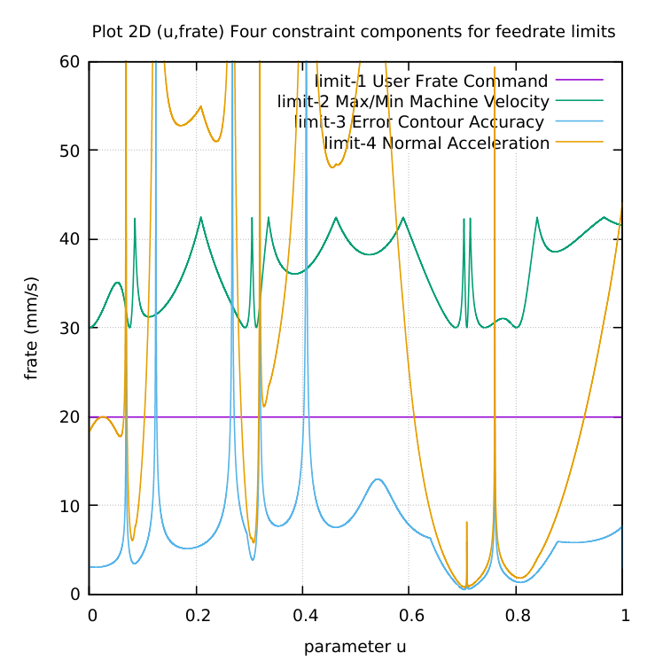
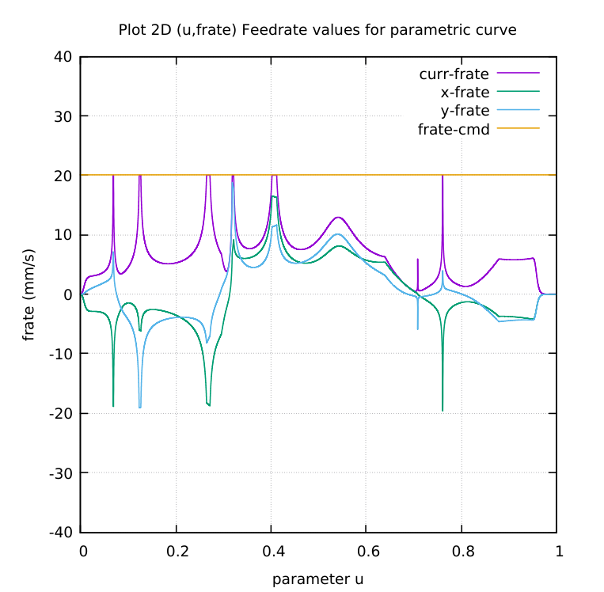

# SNAHYP-parametric-curve
SNAHYP C-codes to generate NGC for CNC milling.
SNAHYP = (SNAILSHELL + HYPOTROCOID) parametric curves.

# The four(4) contributions to the Feedrate Limit

# Current feedrate = minimum of feedrate limits

Wassalam.
WRY
